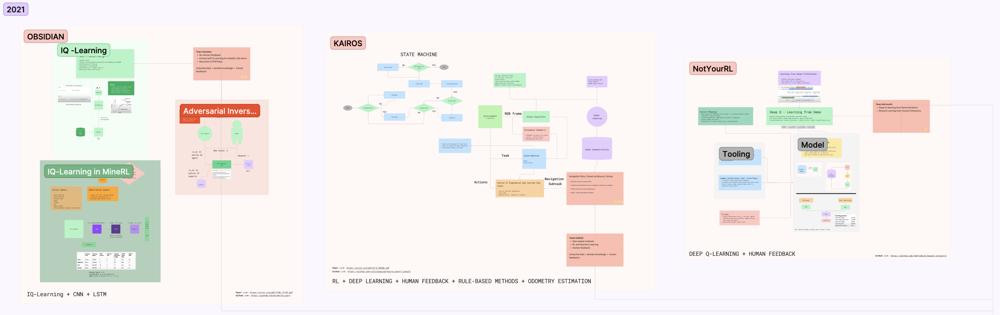
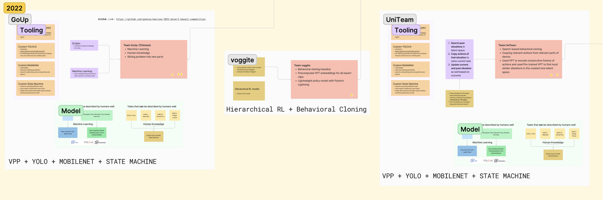
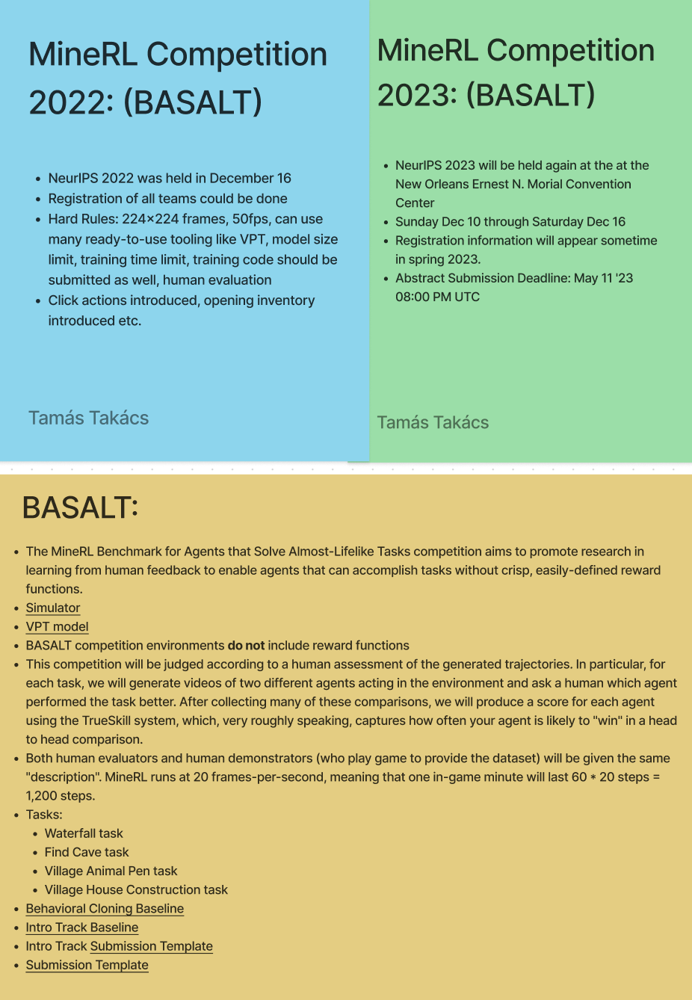

# Thesis Project - Lux AI Competition

This repository is a record of my research journey, starting from brainstorming RL solutions in game environments, diving into RL competitions, and eventually crafting agents for the 2023 Lux AI competition held during the yearly NeurIPS conference.

----

## June:

### Week 3:

Researching Ideas for Auto-Validating Games with RL and Imitation Learning.

As video games grow in size, testing becomes a bigger headache with new bits adding up. This often leads to quick checks or even ignoring testing in some areas. AI can be used as a validation assistant to inform developers about potential bugs or loopholes in their designs. Imitation Learning, also known as Learning from Demonstrations or Learning from Experts, involves training a model to replicate the behavior demonstrated by an expert. In this approach, the model learns from a dataset of expert demonstrations and aims to mimic their actions. It is particularly useful when expert knowledge is available and can be leveraged to guide the learning process. Imitation Learning is commonly used in scenarios where the optimal policy is difficult to directly define or derive, such as in complex control tasks. RL is quite different, since it interacts and learns from an environment through trial and error. The utilization of both or a mixture of these algorithms to learn exploits and find bugs in a game could prove useful.

#### **Tasks**:

* Research novel RL algorithms, that are used frequently in industry and practice. Found OpenAI Spinning-Up. Researched PPO and DQN. ✅
* Find recently published research papers about the usage and limits of imitation learning in game design. All papers are included in the */papers/* directory. ✅
* Find solutions that interlink Reinforcement Learning and Imitation Learning to create a composite Game Validator. ✅
* Find working implementations of simple Game Design Validators. ❌

[OpenAI Spinning-Up Project](https://spinningup.openai.com/en/latest/)

[OpenAI PPO](https://openai.com/research/openai-baselines-ppo)

[OpenAI DQN](https://openai.com/research/openai-baselines-dqn)

### Week 4:

Researching RL platforms and games for benchmarking.

Given the scarcity of well-documented and practical implementations in the worl of Game Validation, the journey for a suitable Reinforcement Learning platform became a must. Notably, OpenAI has made substantial strides in RL research, culminating in the development of OpenAI Gym. This open-source Python library serves as a pivotal resource for the creation and comparison of reinforcement learning algorithms. It establishes a standardized interface for seamless interaction between learning algorithms and diverse environments, accompanied by a comprehensive collection of environments according to this API.

In the year 2021, the ownership of Gym transitioned to the hands of the Farama team, leading to its rebranding as Gymnasium. Gymnasium not only offers an extensive array of native game environments but also supports APIs to seamlessly integrate third-party games like MineRL or gym-derk.

#### **Tasks**:

* Research RL platforms that offer a wide array of APIs to solve RL environments. ✅
* Familiarize with OpenAI Gym and its API to build a basic RL agent. ✅
* MineRL stands out as an ideal game for benchmarking and validating Reinforcement Learning (RL) algorithms in the context of Game Design Validation. Its active competitions, backed by OpenAI and AICrowd, focus on solving four complex problems within tight timeframes, mirroring human-like performance. MineRL's versatile environment allows for the simultaneous application of diverse Deep Learning and RL approaches, addressing challenges in a partially observable, modelless setting devoid of explicit rewards. This unique blend of features positions MineRL as a crucial platform for refining RL techniques and exploring innovative Game Design concepts. ✅
* Explore the realm of possibilities within Minecraft's environment that could be used for exploitation by an agent. Find ways to suggest alternative development ideas to increase task complexity or eliminate exploitory solutions. Task could be: Diamond Collection, Reaching the End Portal, etc. ✅

[MineRL: Basalt Competition 2022](https://minerl.io/basalt/)

[MineRL: Official Competition Page](https://www.aicrowd.com/challenges/neurips-2022-minerl-basalt-competition)

[GymDerk: GPU accelerated MOBA in Gym](https://gym.derkgame.com/)

[OpenAI Gymnasium](https://gymnasium.farama.org/)

----

## July:

### Week 1:

Research the competitions and its environment. Create a basic MineRL agent, that can traverse the map.

In delving into the MineRL framework from an academic perspective, I first studied the previous year's competition paper and thoroughly examined the comprehensive official documentation. Further insights were gained by analyzing scholarly papers from the competition winners, who generously shared their open-source submissions. Additionally, a great livestream, hosted by event organizers provided detailed explanations of these submissions. The combined knowledge gained from these resources was enough to choose a path to follow in the development process.

* Study the competition paper in order to understand the game environment and pre-training processes. ✅
* Go through all available social media content to find hints, smart remarks or other interesting bits that help with familiarizing with the game. ✅
* Create a basic agent, that can traverse the environment and do basic actions. ✅
* Research and create a literature review from past accepted solutions. ✅

[Team Kairos Youtube](https://www.youtube.com/watch?v=0Xu1EkrFefo&t) / [Team Kairos GitHub](https://github.com/viniciusguigo/kairos_minerl_basalt)

[Team Obsidian Youtube](https://www.youtube.com/watch?v=ZOHIFjZB-DM) / [Team Obsidian GitHub](https://github.com/Div99/IQ-Learn)

[Team NotYourRL Youtube](https://www.youtube.com/watch?v=IjNf7Wc3E90&t) / [Team NotYourRL GitHub](https://github.com/TomFrederik/basalt-notyourrl)

[Team GoUp GitHub](https://github.com/gomiss/neurips-2022-minerl-basalt-competition)

[Team Voggite GitHub](https://github.com/shuishida/minerl_2022)

### Week 2:

Research the VPT model and solutions around it.

As for the 2022 MineRL Basalt event, a new tool, called VPT (Video Pre-Training) model was given to competitors to use freely in their submissions. VPT is a trained a neural network to play Minecraft by Video PreTraining (VPT) on a massive unlabeled video dataset of human Minecraft play, while using only a small amount of labeled contractor data. With fine-tuning, the model can learn to craft diamond tools, a task that usually takes proficient humans over 20 minutes (24,000 actions). The model uses the native human interface of keypresses and mouse movements, making it quite general, and represents a step towards general computer-using agents. An IDM model is trained on recorded contractor data that can predict future actions, given a frame of the game. The IDM model can be further used to label even more data, now free of charge.

#### **Tasks**:

* Run an agent using multiple models from the model zoo available on the official GitHub page of the project. ✅
* Run fine-tuned models on Diamond collection or house building. ✅
* Run the IDM model and test it on new unseen video data. ✅
* Fine tune the *1x Width Foundaition Model* to find water. ❌

[OpenAI VPT Blog](https://openai.com/research/vpt) / [OpenAI VPT Paper](https://cdn.openai.com/vpt/Paper.pdf)

[Running IDM](https://www.youtube.com/watch?v=wgmpqLcmTgM)

[Running Foundation](https://www.youtube.com/watch?v=RHcWwsiHP_c)

[Running Foundation with Behavioral Cloning](https://www.youtube.com/watch?v=zjapCRIwXp4)

[Running Foundation with Behavioral Cloning Fine-Tuned for Diamond Collection](https://www.youtube.com/watch?v=fmmf1SHr4jU)

### Week 3:

Be on the lookout for new competitions and conference announcements.

As a result of insufficient sponsorship for the 2023 iteration of the MineRL competition, the project has been temporarily suspended with an indefinite timeline. In light of this, several alternative online competitions and conferences, including but not limited to Kaggle, NeurIPS 2023, and IJCAI 2023, have emerged as potential avenues for participation and engagement.

#### **Tasks**:

* Search for possible conferences, events or online competitions that feature RL as a standard. ✅
* Identifying at least three promising competitions. ✅
* Conducting thorough research on the chosen competitions and creating a decision matrix. ✅
* Making a final recommendation based on emerging news, events and weighted pros and cons. ✅

[NeuralMMO GitHub](https://neuralmmo.github.io/_build/html/rst/landing.html)

[Melting Pot GitHub](https://github.com/deepmind/meltingpot)

[LuxAI Season 2 GitHub](https://github.com/Lux-AI-Challenge/Lux-Design-S2#getting-started)

### Week 4:

My assigned tasks encompassed a comprehensive exploration of the LuxAI Season 2 competition, involving an in-depth review of multiple sources including documentation, the Kaggle platform, and GitHub repositories. 

#### **Tasks**:

* Thoroughly understand the basic and advanced specifications outlined in the official documentation. ✅
* Analyze the Kaggle competition page to gain insights into the competition's structure, rules, and resources. ✅
* Investigate the relevant GitHub repositories to gain a deeper understanding of the competition's technical aspects. ✅
* Grasp the primary goal of the LuxAI Season 2 game, including its mechanics and win conditions. ✅
* Gain insights into how the initial factory bidding process functions and influences gameplay. ✅
* Understand the mechanics of constructing heavy and light machinery within the game environment. ✅
* Delve into the functioning of water and lichen within the game, including their roles and effects. ✅
* Gain a comprehensive understanding of how resource collection, particularly ore and ice, contributes to gameplay. ✅
* Learn how agents interact with factories to deposit resources and contribute to production. ✅
* Understand the rate at which factories consume water, ice, and ore resources. ✅
* Explore the constraints on converting ice and ore resources into water and mental units within factories. ✅
* Grasp how each agent navigates and interacts with the game environment during its turns. ✅
* Determine the time allotted to each agent for making decisions within the game. ✅
* Experiment with Lux Eye, a GUI tool, to visualize and gain insights into gameplay scenarios. ✅

---- 

## August:

## 2023.08.09

- Followed the two tutorials available on the Kaggle page to understand the Gym API.
- Tested a basic agent that chooses actions randomly.
- Tested a basic agent which is trained using PPO to mine ice and keep its factory alive.

[RL with Lux](https://www.kaggle.com/code/stonet2000/rl-with-lux-2-rl-problem-solving/notebook?scriptVersionId=121082267)

## 2023.08.10

 - Created two Dockerfiles, both for CPU and GPU usage.
 - Created a simple reinforcement learning agent template wrapper for future use.
 - Created a Figma board that encompasses the logic behind the game.

## 2023.08.11.

- Fixed the Dockerfile for GPU. It was using the wrong pre-built image and the nVIDIA development libraries were missing.
- Installed Jax and went through the basics to be able to train an agent on the GPU using it.
- Added Build and Run scripts for Docker.
- Fixed project directory hierarchy and decluttered the repository.

## 2023.08.12 - 2023.08.13 (Weekend)

- Trained an RL agent using PPO to bid and place an initial factory and create a heavy robot that could sustain one factory water consumption as long as the episode lasts.
- Researched the Stable-Baselines3 GitHub repository.
- Engaged the trained model in self-play.

[Stable Baselines 3](https://github.com/DLR-RM/stable-baselines3)

## 2023.08.14

- Researched novel RL algorithms in the educational resources produced by OpenAI, Spinning-Up
- Chose algorithms to be used for training a simple heavy robot to survive: DQN, A2C, DDPG, SAC, Twin Delayed DDPG és Truncated Quantile Critics (TQC).
- Trained a model on GPU using Jax.

## 2023.08.15

- Summarized training evaluation metrics.
- Chose key evaluation metrics to compare RL baselines.
- Set Up GitHub Wiki for better managing the research diary.
- Set Up GitHub projects to track the completion rate of tasks and ideas.
- Set Up GitHub Actions for CI/CD practices.
- Changed README in root for a project template.
